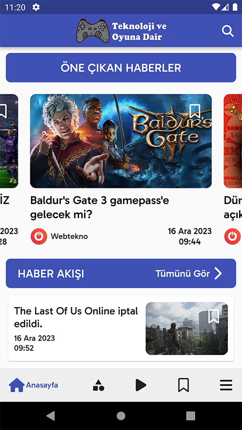
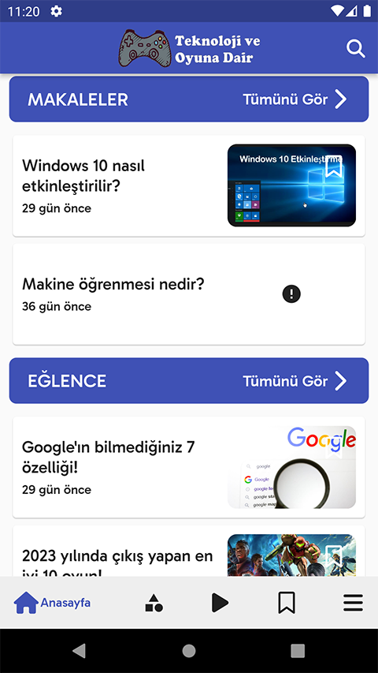
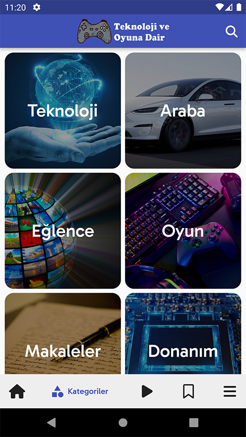
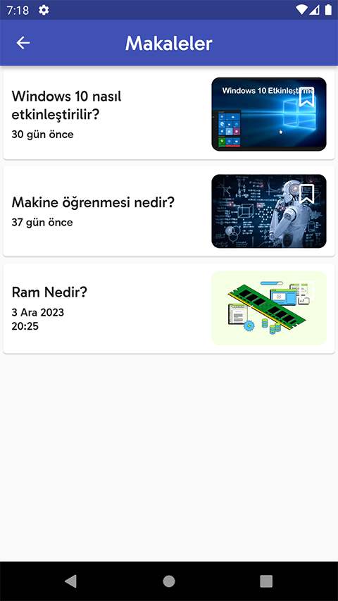
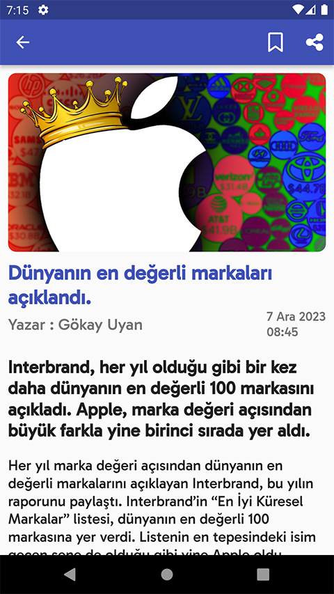
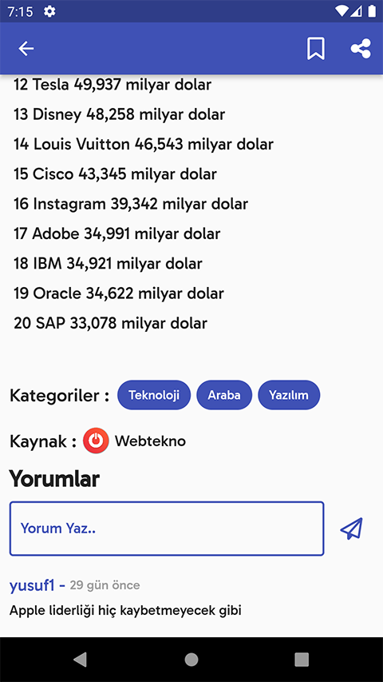
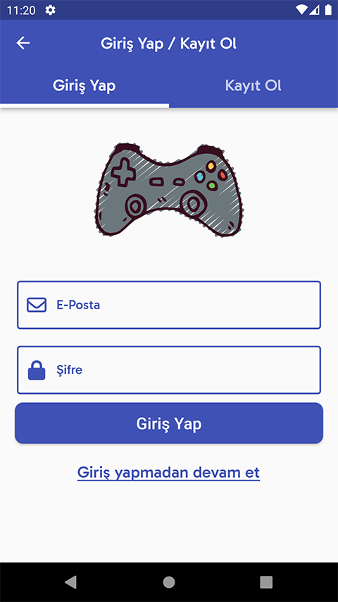
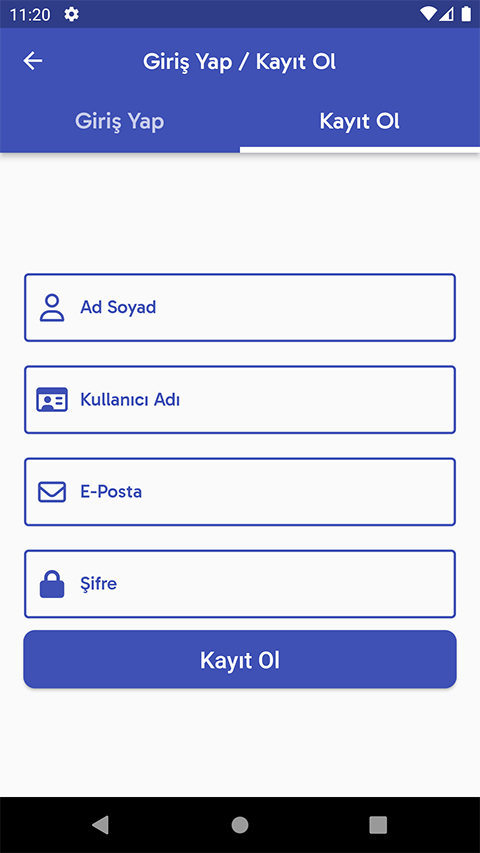
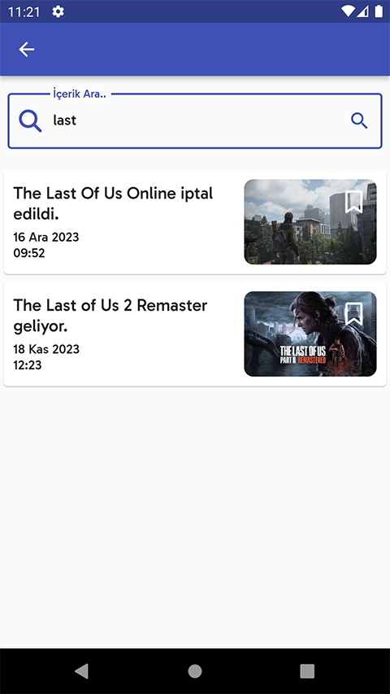
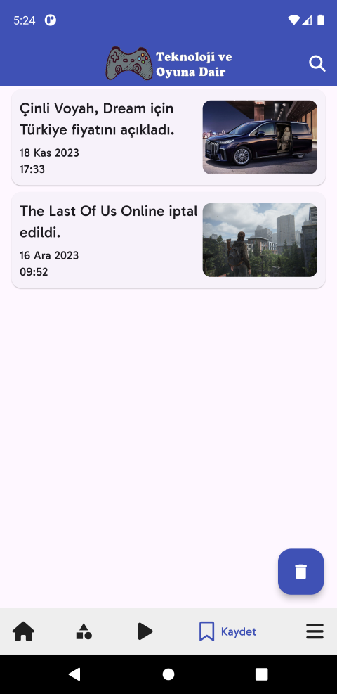

A News App with Flutter 

Features: 
:heavy_check_mark: At home page , user sees classified news like the featured news,news feed,articles,entertainment contents.The cards here display data such as visual, title, publication date, and source related to the news. 
 
:heavy_check_mark: When user clicks on content card its navigate to details screen,at there user sees content title,an image,author,publish date,explanation and text of news or content,categories of content and a comment section. 
 
:heavy_check_mark: Contents are categorized, contents are displayed according to the relevant category clicked on the categories screen. 
 
:heavy_check_mark: The contents are stored at the firebase database. 
 
:heavy_check_mark: There is a videos area where the user can view various videos. 
 
:heavy_check_mark: User can save any content and can delete one or all from saved list of her/his. 
 
:heavy_check_mark: On the menu page, user can be directed to a login registration screen, go to social media accounts, write a message, and view information about the site/application. 
 
:heavy_check_mark: User can log in and register with firebase authentication feature. 
 
:heavy_check_mark: An advertisement is displayed every time the user enters the content detail page 5 times, these advertisements are provided by Admob. 
 
:heavy_check_mark: User can search on contents. 

Technologies: 
:pushpin: Flutter 
:pushpin: Dart 
:pushpin: Firebase Authentication 
:pushpin: Firebase Database 
:pushpin: Google Admob 
:pushpin: Important Packages : firebase_core,firebase_auth,firebase_storage,video_player,google_mobile_ads,ont_awesome_flutter 

Home Screen 
 
 
Categories Screen 
 
 
Details Screen 
 
 
Login - Register Screen 
 
 
Videos Screen 
 
Search Screen 
 
Save Screen 
 

This project developed by [YusufUguz](https://github.com/YusufUguz) 
